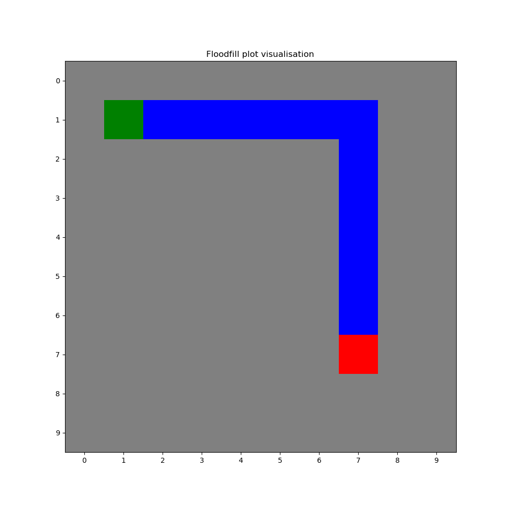

# Floodfill-Algorithm-Simulation
Floodfill algorithm simulation in Python using terminal or matplotlib visualisation

## Example in terminal:

- ### Blank field:
```
0    0    0    0    0    0    0    0    0    0   
0    S    0    0    0    0    0    0    0    0
0    0    0    0    0    0    0    0    0    0
0    0    0    0    0    0    0    0    0    0
0    0    0    0    0    0    0    0    0    0
0    0    0    0    0    0    0    0    0    0
0    0    0    0    0    0    0    0    0    0
0    0    0    0    0    0    0    E    0    0
0    0    0    0    0    0    0    0    0    0
0    0    0    0    0    0    0    0    0    0
```

- ### Floodfilled field:
```
2    1    2    3    4    5    6    7    8    9
1    S    1    2    3    4    5    6    7    8
2    1    2    3    4    5    6    7    8    9
3    2    3    4    5    6    7    8    9    10
4    3    4    5    6    7    8    9    10   11
5    4    5    6    7    8    9    10   11   12
6    5    6    7    8    9    10   11   12   13
7    6    7    8    9    10   11   E    13   14
8    7    8    9    10   11   12   13   14   15
9    8    9    10   11   12   13   14   15   16
```

- ### Shortest path visualised in the filled path:
```
2    1    2    3    4    5    6    7    8    9
1    S    *    *    *    *    *    *    7    8
2    1    2    3    4    5    6    *    8    9
3    2    3    4    5    6    7    *    9    10
4    3    4    5    6    7    8    *    10   11
5    4    5    6    7    8    9    *    11   12
6    5    6    7    8    9    10   *    12   13
7    6    7    8    9    10   11   E    13   14
8    7    8    9    10   11   12   13   14   15
9    8    9    10   11   12   13   14   15   16
```

## Example with matplotlib
<div align="center">

</div>
